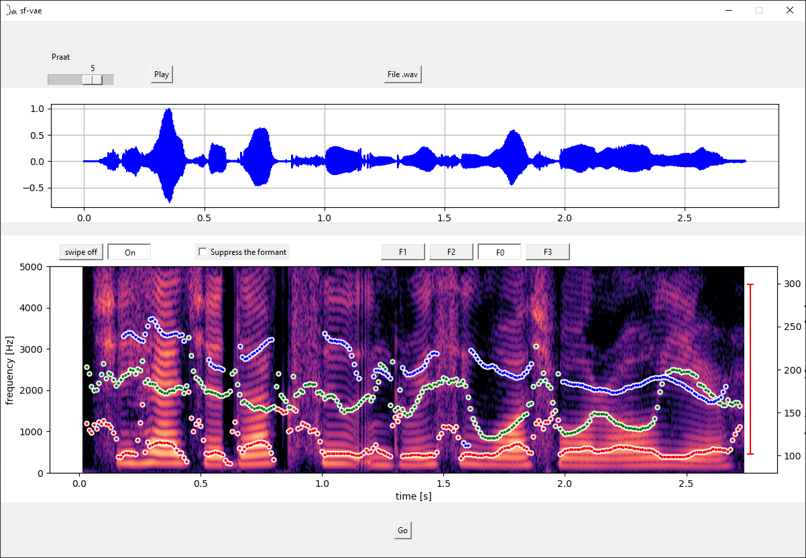

# Learning and controlling the source-filter representation of speech with a variational autoencoder
[](https://github.com/samsad35/source-filter-vae)
[](https://www.python.org/)
[](https://tinyurl.com/iclr2022)
[](https://test.pypi.org/project/sf-vae/)

This repository contains the code associated with the following publication:
> **Learning and controlling the source-filter representation of speech with a variational autoencoder**<br> Samir Sadok, Simon Leglaive, Laurent Girin, Xavier Alameda-Pineda, Renaud Séguier<br>Speech Communication, vol. 148, 2023.

If you use this code for your research, please cite the above paper.

Useful links:
- [Abstract](https://arxiv.org/abs/2204.07075)
- [Paper](https://arxiv.org/pdf/2204.07075.pdf)
- [Demo website with qualitative results](https://samsad35.github.io/site-sfvae/)


## Setup 
- [x] Pypi:  
  - ```pip install -i https://test.pypi.org/simple/ sf-vae --no-deps```
- [x] Install the package locally (for use on your system):  
  - In source-filter-vae directoy: ```pip install -e .```
- [x] Virtual Environment: 
  - ```conda create -n sf_vae python=3.8```
  - ```conda activate sf_vae```
  - In source-filter-vae directoy: ```pip install -r requirements.txt```

## Usage
### LEARNING LATENT SUBSPACES ENCODING SOURCE-FILTER FACTORS OF VARIATION 
```python
import torch
from sf_vae import Learning
from sf_vae import VAE

vae = VAE()
checkpoint = torch.load(r"checkpoints\vae_trained")
vae.load_state_dict(checkpoint['model_state_dict'])
learn = Learning(config_factor=dict(factor="f1", path_trajectory="formant_1\\f2-1600", dim=3),
                 # f0: pitch (source), f1, f2, f3: formants (filter)
                model=vae,
                path_save=r"checkpoints\pca-regression")
learn()
```
- You can download the trajectories of the formants and the pitch in the [following link](https://drive.google.com/file/d/1807TYczP9qp9N-47s-cGyn7vxft0RqvI/view?usp=sharing).
### CONTROLLING THE FACTORS OF VARIATION FOR SPEECH TRANSFORMATION
```python
import torch
from sf_vae import Controlling
from sf_vae import VAE

vae = VAE()
checkpoint = torch.load(r"checkpoints\vae_trained")
vae.load_state_dict(checkpoint['model_state_dict'])
control = Controlling(path=r"checkpoints\pca-regression",
                    model=vae,
                    device="cuda")
control(path_wav=r"01aa0101.wav", 
        factor='f0', # f0: pitch (source), f1, f2, f3: formants (filter)
        y=(85, 300)) # The new values of the factor in Hz
```
* Phase reconstruction method:
  * [x] RTISI_LA
  * [ ] Griffin_lim
  * [ ] WaveGlow
* Whispering
```python
import torch
from sf_vae import Controlling
from sf_vae import VAE

vae = VAE()
checkpoint = torch.load(r"checkpoints\vae_trained")
vae.load_state_dict(checkpoint['model_state_dict'])
control = Controlling(path=r"checkpoints\pca-regression",
                    model=vae,
                    device="cuda")
z_ = control.whispering(path_wav=r"01aa0101.wav")
control.reconstruction(z_, save=True)
```

## GUI: graphic interface
```python
from sf_vae import Interface
from sf_vae import VAE
import torch

vae = VAE()
checkpoint = torch.load(r"checkpoints\vae_trained")
vae.load_state_dict(checkpoint['model_state_dict'])
inter = Interface(device="cuda", model=vae, path=r"checkpoints\pca-regression")
inter.master.mainloop()
```


## License
GNU Affero General Public License (version 3), see LICENSE.txt.